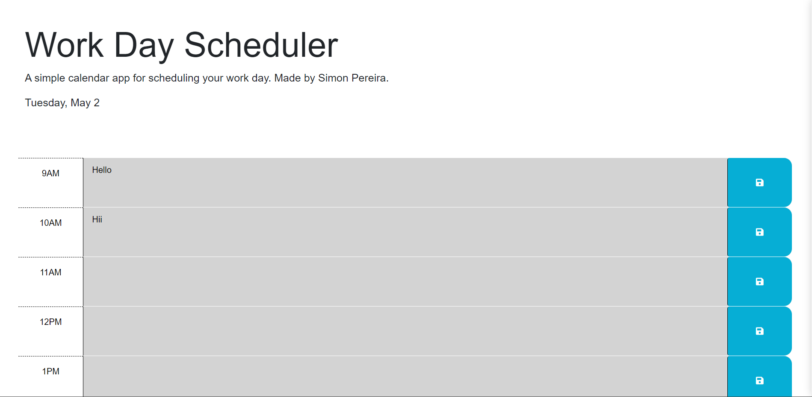

# Work Day Scheduler

## Description

This is a Work Day Scheduler built using JavaScript, jQuery and DayJS. The user can see the current date, and add and save input to each time block for typical work hours.

Made for the Week 5 Challenge of the UM Coding Bootcamp.

## Screenshoot

## Link

You can see the deployed app here:

- https://spereira15.github.io/work-day-scheduler/

